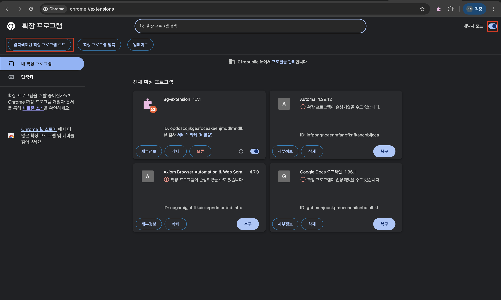
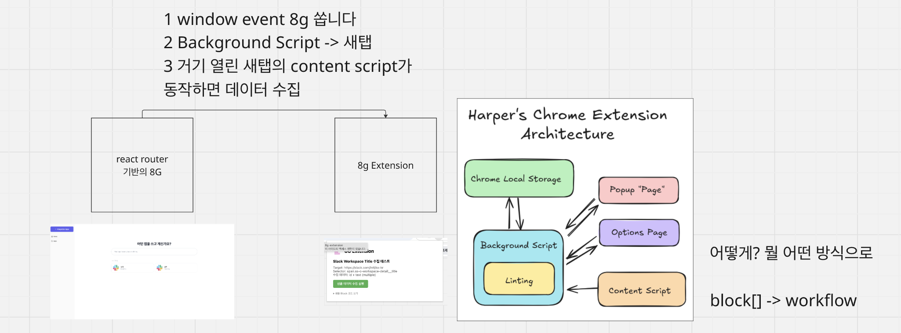

# 8G Extension 에 오신걸 환영합니다!

웹에서 데이터를 안정적으로 수집/자동화하기 위한 Chrome 확장 프로그램과 브라우저용 SDK를 제공합니다. 이 README는 실제 프로젝트 구조와 SDK 사용법, 빌드/배포 방법을 한곳에 정리합니다.

## How to Run

1) 의존성 설치

```bash
npm install
# 또는
pnpm install
```

2) 개발 서버 실행(확장 개발)

```bash
npm run dev
```

3) 크롬에서 로컬 확장 로딩

- 주소창에 `chrome://extensions/` 접속 → 우상단 "개발자 모드" 활성화
- "압축 해제된 확장 프로그램을 로드" 클릭 후 `dist` 디렉터리 선택


4) SDK 빌드(패키지 용)

```bash
npm run build
# SDK: vite.sdk.config.ts 기반 번들 + ts 타입 생성(tsconfig.sdk.json)
```

5) 확장 번들(Zip) 생성

```bash
npm run build:extension
# release/crx-8g-extension-<version>.zip 생성
```

## 개발 스크립트

`package.json`의 주요 스크립트 요약:

- `dev`: Vite 개발 서버(확장) 실행
- `build`: SDK 번들 빌드(es 모듈, 타입 포함)
- `build:extension`: 확장 프로그램 빌드 및 zip 패키징
- `test`, `test:run`, `test:ui`: Vitest 테스트 실행
- `lint`, `lint:fix`: ESLint 검사/수정
- `format`, `format:check`: Prettier 포맷팅


## 전체적인 구조 소개
`8g-extension`은 다음을 포함합니다.
- **Chrome Extension**: `content script`, `background service worker`, `popup` UI 구성
- **브라우저/번들러용 SDK**: 웹페이지에서 확장과 메시지로 통신하여 블록/워크플로우를 실행



## 크롬 확장 개발/로딩

- 매니페스트는 `manifest.config.ts`에서 CRXJS `defineManifest`로 선언합니다.
- `background` 엔트리는 `src/background/index.ts`이며, 내부에서 `BackgroundManager`가 메시지를 처리합니다.
- `content_scripts` 엔트리는 `src/content/main.tsx`로, 내부/외부 메시지 커널을 초기화합니다.
- 개발 시 `npm run dev`로 빌드·감시 후 `chrome://extensions/`에서 `dist`를 다시 로드하세요.

## SDK 사용 가이드(요약)

**중요**: v2.x부터 **모든 블록 실행은 워크플로우를 통해서만** 가능합니다.

패키지 설치 후 SDK를 초기화하고 워크플로우를 실행할 수 있습니다.

```ts
import { EightGClient } from '8g-extension';

const client = new EightGClient();
await client.checkExtension();

// 단일 블록도 워크플로우로 실행
const simpleWorkflow = {
  version: '1.0',
  start: 'getTitle',
  steps: [
    { 
      id: 'getTitle', 
      block: { 
        name: 'get-text', 
        selector: '#title', 
        findBy: 'cssSelector', 
        option: {},
        useTextContent: true 
      }
    }
  ]
};

const result1 = await client.collectWorkflow({
  targetUrl: location.href,
  workflow: simpleWorkflow
});

// 복잡한 워크플로우: 분기, 조건, 순차 실행
const complexWorkflow = {
  version: '1.0',
  start: 'readStatus',
  steps: [
    { 
      id: 'readStatus', 
      block: { name: 'get-text', selector: '.status', findBy: 'cssSelector', useTextContent: true, option: {} },
      switch: [ 
        { when: { equals: { left: "$.steps.readStatus.result.data", right: 'OK' } }, next: 'go' } 
      ], 
      next: 'retry' 
    },
    { id: 'go', block: { name: 'event-click', selector: '.go', findBy: 'cssSelector', option: {} }, delayAfterMs: 300, next: 'done' },
    { id: 'retry', block: { name: 'event-click', selector: '.retry', findBy: 'cssSelector', option: {} }, delayAfterMs: 300, next: 'done' },
    { id: 'done', block: { name: 'get-text', selector: '.result', findBy: 'cssSelector', option: { waitForSelector: true } } },
  ],
};

const result2 = await client.collectWorkflow({
  targetUrl: location.href,
  workflow: complexWorkflow,
  closeTabAfterCollection: true,
});
```

자세한 사용법, JSON 스키마/조건식/바인딩, 실행 규칙은 아래 문서를 참고하세요.

- 워크플로우 가이드: `WORKFLOW_EXECUTION_ARCHITECTURE.md`
- 블록 아키텍처: `BLOCK_EXECUTION_ARCHITECTURE.md`

## 프로젝트 구조

- `manifest.config.ts`: MV3 매니페스트(permissions/host_permissions, content/background 설정)
- `src/background/`:
  - `index.ts`: 백그라운드 초기화
  - `BackgroundManager.ts`: 탭 생성/정리, 블록/워크플로우 실행 요청 처리
  - `WorkflowRunner.ts`: 워크플로우 실행 로직
- `src/content/main.tsx`: 메시지 커널 및 내부/외부 핸들러 초기화
- `src/blocks/*`: 블록 정의/테스트
- `src/sdk/*`: `EightGClient`, 에러/타입, `index.ts`(엔트리)
- `vite.config.ts`: 확장 빌드용 Vite 설정(CRXJS/zip)
- `vite.sdk.config.ts`: SDK 빌드용 Vite 설정(ESM, 외부 의존 지정)
- `vitest.config.ts`: 테스트 설정

## 전체 아키텍처와 실행 흐름

### 구성 요소 개요
- **SDK (`src/sdk/*`)**: 웹페이지(JavaScript)에서 사용하는 클라이언트. 확장과 `window.postMessage` → Content Script → Background 메시지로 통신합니다. 대표 엔트리: `EightGClient`.
- **Content Script (`src/content/*`)**: 웹페이지와 확장 내부를 잇는 브리지. 외부/내부 메시지를 라우팅하는 `MessageKernel`, `ExternalMessageHandler`, `InternalMessageHandler`가 핵심입니다.
- **Background (`src/background/*`)**: 탭 생성/제어, 블록 실행 지휘, 워크플로우 런 실행 등의 오케스트레이션을 담당합니다. `BackgroundManager`, `TabManager`, `WorkflowRunner`가 핵심입니다.
- **Blocks (`src/blocks/*`)**: 실제 DOM 상호작용/데이터 수집을 수행하는 도메인 유닛. 블록별 `validate*` + `handler*` 조합으로 동작하며, `BlockHandler.executeBlock`이 진입점입니다.
- **Popup (`src/popup/*`)**: 데모/수동 실행 UI.

### 연결 관계(요약 다이어그램)
```
Webpage(JS) ─ SDK(EightGClient)
     │            │  window.postMessage('8G_*')
     └────────────▼─────────────────────────────
                 Content Script
     ExternalMessageHandler ↔ MessageKernel ↔ InternalMessageHandler
                 │                  │
                 │    chrome.runtime.sendMessage
                 ▼                  │
               Background ──────────┘
     BackgroundManager ↔ TabManager ↔ WorkflowRunner
                 │
     executeBlock(→ Content Script → BlockHandler → 블록 핸들러)
                 │
                 └── 결과 집계 후 응답(역방향 경로로 반환)
```

### 요청 흐름: 워크플로우 실행 (`collectWorkflow`)
1. 웹페이지에서 SDK `EightGClient.collectWorkflow` 호출 → `window.postMessage({ type: '8G_COLLECT_WORKFLOW', ... })` 전송
2. Content Script의 `ExternalMessageHandler`가 수신 → Background로 `COLLECT_WORKFLOW_NEW_TAB` 메시지 전달
3. Background `WorkflowService`가 탭 생성 후, 워크플로우 실행 시작
   - `WorkflowRunner`가 `start` 스텝부터 시작하여 `steps`를 따라 진행
   - 각 스텝에서 `when` 조건 평가, `retry` 재시도, `timeoutMs` 타임아웃 처리
   - 블록 실행은 `TabManager.executeBlock` → 대상 탭의 Content Script로 `ExecuteBlockMessage` 송신
   - Content Script `MessageKernel.executeBlock` → `BlockHandler` 호출 → 블록별 `validate*` 후 `handler*` 실행
4. 각 스텝의 결과(성공/실패/시각/메시지)를 기록하며 다음 스텝으로 진행 (`next`, `switch`, `onSuccess/onFailure`)
5. 워크플로우 완료 시 모든 스텝 로그를 Content Script로 전달
6. Content Script가 웹페이지로 `8G_COLLECT_RESPONSE`를 `window.postMessage`하여 SDK가 Promise resolve

참고: `delayAfterMs`로 스텝 간 대기 시간을 조정할 수 있습니다.


### 블록 시스템 구조
- 공통 형태(`src/blocks/types.ts`)
  - `Block`: `name`, `selector`, `findBy('cssSelector'|'xpath')`, `option { waitForSelector?, waitSelectorTimeout?, multiple? }`
  - `BlockResult<T>`: `data`, `hasError?`, `message?`
- 실행 파이프라인
  - `BlockHandler.executeBlock(block)` → 블록 이름으로 분기 → `validate*`로 스키마 검증 → `handler*`에서 DOM 상호작용/추출 실행
  - 셀렉터 해석과 탐색은 `src/content/elements/*`의 `findElement`와 `XPathSelector/CssSelector`가 담당
- 지원 블록(요약)
  - `get-text`: 텍스트 추출(정규식/`textContent`/태그 포함 옵션)
  - `attribute-value`: 속성 값 추출(단일/다중)
  - `get-value-form` / `set-value-form` / `clear-value-form`: 폼 값 읽기/설정/초기화
  - `element-exists`: 존재 여부 확인(Boolean)
  - `event-click`: 요소 클릭(다중 요소 + 텍스트 필터 선택 가능)
  - `save-assets`: 이미지/리소스 수집 및 저장
  - `get-element-data`: 텍스트/속성/선택자/XPath 등 복합 데이터 추출
  - `scroll`: 페이지 스크롤(toElement, toBottom, byDistance, untilLoaded)
  - `keypress`: 키보드 입력 시뮬레이션(Escape, Enter 등, modifier 키 지원)
  - `wait`: 지정 시간 대기(ms)
  - `fetch-api`: 외부 API 호출(GET, POST 등, CORS 제약 없음)
  - `ai-parse-data`: AI 기반 데이터 파싱(OpenAI, 스키마 정의 필요)

### SDK 상세(브라우저에서 사용)
- `EightGClient.checkExtension()`
  - 확장 주입 여부 확인. 내부적으로 `8G_EXTENSION_CHECK` 메시지를 사용
  - 타임아웃: 5초
- `EightGClient.collectWorkflow({ targetUrl, workflow, closeTabAfterCollection?, activateTab? })`
  - **유일한 블록 실행 방법** - 모든 블록은 워크플로우를 통해서만 실행
  - `workflow`: `{ version, start, steps[] }` 형식
  - 각 스텝: `{ id, block?, when?, switch?, next?, onSuccess?, onFailure?, retry?, timeoutMs?, delayAfterMs?, setVars? }`
  - 반환: `{ success, steps, error?, timestamp, targetUrl }` (스텝별 성공/실패/메시지/시각/재시도 횟수 포함)
  - 타임아웃: 기본 60초

### 주요 내부 모듈과 연결 관계
- `src/content/kernel/MessageKernel.ts`: Background 통신, 블록 실행(락 관리 포함), 런타임 메시지 처리
- `src/content/handler/ExternalMessageHandler.ts`: 웹페이지(Window) ↔ Content Script 브리지
- `src/content/handler/InternalMessageHandler.ts`: Background ↔ Content Script 브리지
- `src/background/BackgroundManager.ts`: 메시지 라우팅 담당 (워크플로우, CDP, AI 파싱)
- `src/background/WorkflowService.ts`: 워크플로우 실행 전담
- `src/background/WorkflowRunner.ts`: 워크플로우 루프, 분기/바인딩/재시도/타임아웃 처리
- `src/background/CdpService.ts`: Chrome DevTools Protocol 처리 (클릭, 키보드 입력)
- `src/background/ApiService.ts`: 외부 API 요청 처리 (fetch, CORS 우회)
- `src/background/AiParsingService.ts`: AI 파싱 처리 (OpenAI 연동)
- `src/background/TabManager.ts`: 탭 생성/활성화, 특정 탭에 블록 실행 위임
- `src/blocks/index.ts`: `BlockHandler.executeBlock` 진입점 (블록별 validate/handler 매핑)
- `src/content/elements/*`: CSS/XPath 셀렉터 빌드/탐색, 대기 옵션 처리

### 응답과 에러 처리
- 모든 경로는 에러 시 `$isError`(내부), 또는 SDK 측 `{ success: false, error }` 형태로 표준화
- SDK는 응답 메시지(`8G_COLLECT_RESPONSE`)를 `requestId`로 매칭하여 Promise를 해제
- 공통 타임아웃/통신 오류는 `EightGError`로 래핑됨

### 추가 참고 문서
- **워크플로우 가이드** (필수): `WORKFLOW_EXECUTION_ARCHITECTURE.md` - 워크플로우 실행 방법, JSON 스키마, 조건식, 바인딩
- **블록 카탈로그**: `BLOCKS.md` - 모든 블록의 상세 사용법과 예시
- **아키텍처 문서**: `BLOCK_EXECUTION_ARCHITECTURE.md` - 내부 구조와 아키텍처 변경사항
