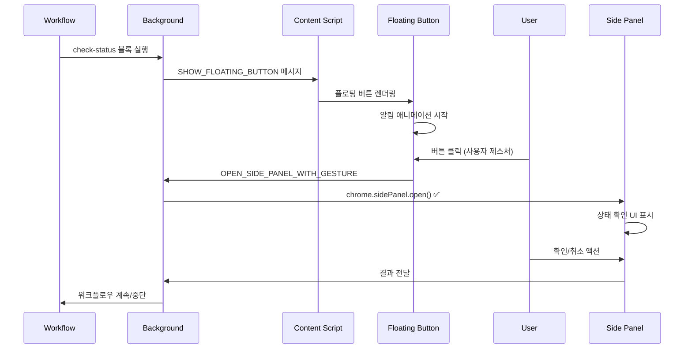

# 워크플로우 진행상황 체크 시스템 V2 - 리팩토링 계획

## 🎯 핵심 변경사항

### 문제점
- Chrome Side Panel API는 `sidePanel.open()`을 사용자 제스처(클릭 등) 없이 호출할 수 없음
- 워크플로우 자동 실행 중에는 사용자 제스처가 없어 직접 열 수 없음

### 해결 방안
**2단계 접근법**: 플로팅 버튼 먼저 표시 → 사용자 클릭 → Side Panel 열기

```
워크플로우 실행
    ↓
플로팅 버튼 표시 (알림 뱃지 포함)
    ↓
사용자가 버튼 클릭 (제스처)
    ↓
Side Panel 열기 ✅
```

---

## 📋 리팩토링 아키텍처

### 1. 실행 플로우



### 2. 컴포넌트 구조

#### 2.1 플로팅 버튼 (Content Script)
```typescript
// src/content/components/FloatingNotificationButton.tsx
interface FloatingNotificationButtonProps {
  message: string;           // "로그인 확인이 필요합니다"
  badge?: number;            // 알림 개수
  urgency: 'low' | 'medium' | 'high';
  onClick: () => void;       // Side Panel 열기 트리거
}
```

**주요 기능:**
- 워크플로우 실행 시 자동 표시
- 펄스 애니메이션으로 주의 끌기
- 알림 뱃지로 대기 중인 작업 표시
- 클릭 시 사용자 제스처로 Side Panel 열기

#### 2.2 Side Panel (별도 앱)
```
src/sidepanel/
├── index.html
├── main.tsx
├── App.tsx
├── store/              # 상태 관리
│   └── checkStatusStore.ts
├── components/
│   ├── StatusChecker.tsx
│   ├── LoginStatus.tsx
│   ├── PageLoadStatus.tsx
│   └── ActionButtons.tsx
└── styles/
    └── sidepanel.css
```

#### 2.3 CheckStatusBlock 수정
```typescript
export interface CheckStatusBlock {
  name: 'check-status';
  checkType: CheckType;
  title: string;
  description?: string;
  notification?: {
    message: string;        // 플로팅 버튼에 표시할 메시지
    urgency?: 'low' | 'medium' | 'high';
  };
  options?: {
    timeoutMs?: number;
    autoOpen?: boolean;     // false: 플로팅 버튼만, true: 가능하면 자동 오픈
  };
}
```

---

## 🔄 구현 단계

### Phase 1: 플로팅 알림 버튼 시스템 (2일)
- [ ] FloatingNotificationButton 컴포넌트 구현
  - [ ] 다양한 상태 표시 (대기, 긴급, 완료)
  - [ ] 알림 뱃지 시스템
  - [ ] 드래그 가능한 위치 조정
  - [ ] 펄스/바운스 애니메이션
- [ ] Content Script 통합
  - [ ] 이벤트 리스너 설정
  - [ ] 메시지 핸들링
- [ ] StatusUI와 위치 충돌 방지
  - [ ] 자동 위치 조정 알고리즘
  - [ ] 스택 형태로 여러 알림 관리

### Phase 2: Side Panel 시스템 복원 (2일)
- [ ] Side Panel 앱 재구현
  - [ ] React 기반 UI 복원
  - [ ] 상태 관리 (Context or Zustand)
  - [ ] 실시간 업데이트 시스템
- [ ] Background Service 수정
  - [ ] SidePanelService 복원 및 개선
  - [ ] 사용자 제스처 감지 로직
  - [ ] 대기열 관리 시스템

### Phase 3: 통신 및 동기화 (1일)
- [ ] 메시지 프로토콜 정의
  ```typescript
  // Content → Background
  SHOW_FLOATING_NOTIFICATION
  USER_CLICKED_NOTIFICATION
  
  // Background → Side Panel
  INIT_CHECK_STATUS
  UPDATE_STATUS
  
  // Side Panel → Background
  USER_ACTION_RESULT
  ```
- [ ] 상태 동기화
  - [ ] 플로팅 버튼 ↔ Side Panel 상태 동기화
  - [ ] 워크플로우 컨텍스트 유지

### Phase 4: CheckStatusBlock 통합 (1일)
- [ ] Block 핸들러 수정
  - [ ] 2단계 실행 로직
  - [ ] Promise 체인 관리
- [ ] 타임아웃 처리
  - [ ] 플로팅 버튼 표시 타임아웃
  - [ ] Side Panel 응답 타임아웃

### Phase 5: UX 개선 (1일)
- [ ] 애니메이션 및 전환 효과
  - [ ] 플로팅 버튼 → Side Panel 전환
  - [ ] 상태별 아이콘 애니메이션
- [ ] 접근성
  - [ ] 키보드 네비게이션
  - [ ] 스크린 리더 지원
- [ ] 다국어 지원 준비

---

## 💡 주요 설계 결정사항

### 1. 왜 플로팅 버튼을 먼저 보여주는가?
- Chrome API 제약 우회
- 사용자에게 명확한 액션 포인트 제공
- 작업을 방해하지 않는 비침투적 알림

### 2. 상태 관리 전략
- **플로팅 버튼**: 단순 표시 상태만 관리
- **Side Panel**: 복잡한 상태 및 상호작용 관리
- **Background**: 전체 조율 및 워크플로우 연동

### 3. 에러 처리
- 사용자가 플로팅 버튼을 무시하는 경우 → 타임아웃
- Side Panel 열기 실패 → 폴백으로 모달 표시
- 통신 실패 → 자동 재시도 (3회)

---

## 🚀 예상 사용 시나리오

### 시나리오 1: 로그인 확인
```json
{
  "name": "check-status",
  "checkType": "login",
  "title": "로그인 상태 확인",
  "description": "계속하려면 로그인이 필요합니다",
  "notification": {
    "message": "로그인 확인 필요 🔐",
    "urgency": "high"
  }
}
```

1. 워크플로우 실행 중 로그인 확인 필요
2. 우측 하단에 플로팅 버튼 표시 (빨간 뱃지, 펄스 애니메이션)
3. 사용자가 버튼 클릭
4. Side Panel 열림 → 로그인 상태 확인 UI
5. 사용자가 [확인] 클릭
6. 로그인 체크 → 성공/실패 표시
7. 워크플로우 계속/중단

### 시나리오 2: 다중 확인 (Queue)
- 여러 check-status 블록이 대기 중일 때
- 플로팅 버튼에 뱃지 숫자 표시 (예: 3)
- Side Panel에서 순차적으로 처리

---

## 📊 기술 스택

- **UI Framework**: React 19
- **상태 관리**: Context API (간단) or Zustand (복잡)
- **스타일링**: CSS Modules + CSS Variables
- **애니메이션**: CSS Animations + Framer Motion (선택)
- **타입 안전성**: TypeScript + Zod

---

## ✅ 체크리스트

### 개발 전
- [ ] 기존 코드 백업
- [ ] 브랜치 생성 (`feature/sidepanel-v2`)
- [ ] 의존성 확인

### 개발 중
- [ ] 단위 테스트 작성
- [ ] Chrome 다양한 버전 테스트
- [ ] 성능 프로파일링

### 개발 후
- [ ] 문서 업데이트
- [ ] CHANGELOG 작성
- [ ] PR 생성

---

## 🎨 UI/UX 가이드라인

### 플로팅 버튼
- **기본 상태**: 회색, 작은 크기
- **알림 상태**: 색상 변경, 펄스 효과
- **긴급 상태**: 빨간색, 바운스 효과
- **호버**: 툴팁으로 메시지 미리보기

### Side Panel
- **헤더**: 8G Extension 브랜딩
- **본문**: 카드 형태의 상태 확인 UI
- **푸터**: 액션 버튼 (확인/취소/다시시도)

---

## 📝 참고사항

### Chrome API 제약사항
- `sidePanel.open()`은 반드시 사용자 제스처 컨텍스트에서 호출
- 한 번에 하나의 Side Panel만 열 수 있음
- Side Panel은 탭별로 독립적

### 대안 고려사항
- 극단적인 경우 Chrome Action 버튼 활용
- 폴백으로 모달 다이얼로그 준비
- 향후 Chrome API 개선 시 즉시 적용 가능한 구조

---

*작성일: 2024년 11월 20일*  
*버전: 2.0.0*  
*작성자: 8G Extension Team*