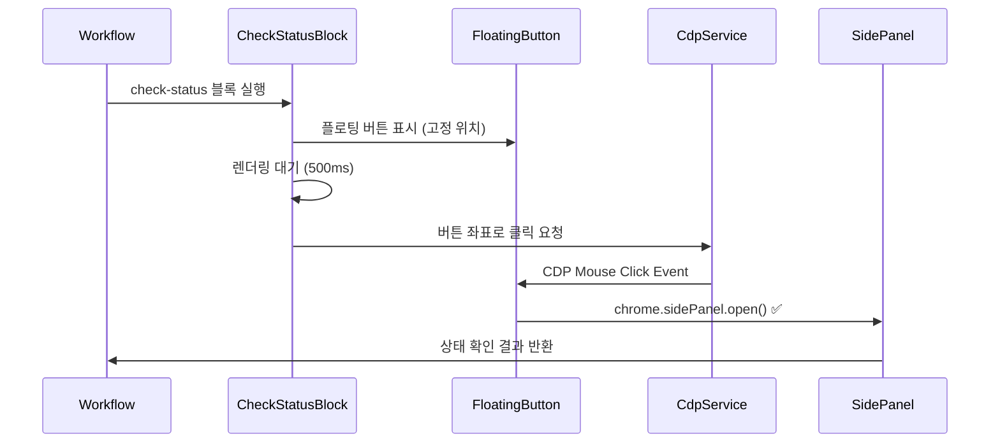

# CDP 자동 클릭 시스템 설계서

## 📌 개요

워크플로우 실행 중 CheckStatusBlock에서 플로팅 버튼을 자동으로 클릭하여 사용자 개입 없이 Side Panel을 여는 시스템 설계

### 핵심 아이디어

- Chrome DevTools Protocol(CDP)을 사용하여 플로팅 버튼을 프로그래밍 방식으로 클릭
- CDP 클릭은 실제 사용자 제스처로 인식되어 Side Panel API 제약 우회 가능

## ✅ 구현 완료 (2024-11-20)

## 🎯 목표

1. **자동화**: 사용자 클릭 없이 Side Panel 자동 열기
2. **안정성**: 고정된 위치와 최상위 z-index로 클릭 성공률 보장
3. **유연성**: 자동/수동 모드 선택 가능

## 🏗️ 아키텍처

### 실행 플로우



### 컴포넌트 변경사항

#### 1. FloatingNotificationButton 수정

```typescript
interface FloatingNotificationButtonProps {
  // 기존 props...
  fixedPosition?: boolean; // 위치 고정 여부
  position?: { x: number; y: number }; // 고정 위치 좌표
  disableDrag?: boolean; // 드래그 비활성화
  dataAttributes?: {
    // CDP 클릭을 위한 데이터
    notificationId: string;
    autoClickTarget: boolean;
  };
}

// 고정 위치 설정
const FIXED_POSITION = {
  x: 60, // right: 60px (안전 마진)
  y: 200, // bottom: 200px (다른 UI와 충돌 방지)
};

// 최상위 z-index
const Z_INDEX = 2147483647; // 최대값 사용
```

#### 2. CheckStatusBlock 스키마 확장

```typescript
export interface CheckStatusBlock {
  name: 'check-status';
  checkType: CheckType;
  title: string;
  description?: string;
  notification?: {
    message: string;
    urgency?: 'low' | 'medium' | 'high';
  };
  options?: {
    timeoutMs?: number;
    retryable?: boolean;
    autoClick?: boolean; // CDP 자동 클릭 활성화
    clickDelay?: number; // 클릭 전 대기 시간 (ms)
    fallbackToManual?: boolean; // 자동 클릭 실패 시 수동 모드
  };
}
```

#### 3. CDP 클릭 로직

```typescript
// CheckStatusBlock handler 내부
async function handleAutoClick(block: CheckStatusBlock, notificationId: string) {
  if (!block.options?.autoClick) {
    return false;
  }

  try {
    // 1. 버튼 렌더링 대기
    const delay = block.options.clickDelay || 500;
    await new Promise((resolve) => setTimeout(resolve, delay));

    // 2. 버튼 좌표 계산
    const coords = calculateButtonCoordinates();

    // 3. CDP 클릭 실행
    await chrome.runtime.sendMessage({
      type: 'CDP_CLICK',
      data: {
        x: coords.x,
        y: coords.y,
        targetId: notificationId,
      },
    });

    // 4. Side Panel 열림 확인
    return await waitForSidePanelOpen(notificationId);
  } catch (error) {
    console.error('[AutoClick] Failed:', error);

    // 폴백 처리
    if (block.options.fallbackToManual) {
      console.log('[AutoClick] Falling back to manual mode');
      return false; // 수동 모드로 전환
    }

    throw error;
  }
}
```

## 📍 좌표 계산 전략

### 방법 1: 뷰포트 기반 고정 좌표 (권장)

```typescript
function calculateButtonCoordinates(): { x: number; y: number } {
  // 뷰포트 크기 가져오기
  const viewport = {
    width: window.innerWidth,
    height: window.innerHeight,
  };

  // 고정 위치에서 버튼 중심점 계산
  // 버튼 크기: 60x60px
  const buttonSize = 60;
  const position = {
    right: 60, // CSS right 값
    bottom: 200, // CSS bottom 값
  };

  return {
    x: viewport.width - position.right - buttonSize / 2,
    y: viewport.height - position.bottom - buttonSize / 2,
  };
}
```

### 방법 2: DOM 요소 직접 조회 (백업)

```typescript
function getButtonCoordinatesFromDOM(): { x: number; y: number } | null {
  const button = document.querySelector('[data-auto-click-target="true"]');
  if (!button) return null;

  const rect = button.getBoundingClientRect();
  return {
    x: rect.left + rect.width / 2,
    y: rect.top + rect.height / 2,
  };
}
```

## 🔧 구현 완료 사항

### Phase 1: 플로팅 버튼 위치 고정 ✅

- [x] FloatingNotificationButton에 고정 위치 옵션 추가 (`fixedPosition`, `disableDrag`)
- [x] 드래그 비활성화 옵션 구현
- [x] z-index 최상위로 설정 (2147483647)
- [x] data attribute 추가 (`data-auto-click-target`, `data-position-x`, `data-position-y`)

### Phase 2: CDP 클릭 통합 ✅

- [x] CheckStatusBlock 스키마에 autoClick 옵션 추가
- [x] CDP 클릭 요청 메시지 타입 정의
- [x] BackgroundManager에서 CDP_CLICK 핸들러 확인 (기존 구현 활용)
- [x] CdpService에 좌표 클릭 메서드 확인 (이미 구현됨)

### Phase 3: 실행 플로우 구현 ✅

- [x] CheckStatusBlock handler에 자동 클릭 로직 추가
- [x] 버튼 렌더링 대기 로직 (clickDelay 활용)
- [x] CDP 클릭 좌표 계산 및 실행
- [x] 타임아웃 및 에러 처리

### Phase 4: 폴백 처리 ✅

- [x] 자동 클릭 실패 시 수동 모드 전환 옵션 (`fallbackToManual`)
- [x] 에러 로깅 및 디버깅 정보
- [x] 콘솔 로그를 통한 상태 추적

## ⚠️ 주의사항

### 1. 타이밍 이슈

- 버튼이 완전히 렌더링된 후 클릭 필요
- 최소 500ms 대기 권장
- React 렌더링 사이클 고려

### 2. 좌표 정확성

- 스크롤 위치와 무관하게 뷰포트 기준 좌표 사용
- 버튼 크기(60x60) 중앙점 계산
- DevTools 열림 상태에서도 정확한 좌표 보장

### 3. CDP 권한

- debugger 권한이 이미 활성화되어 있어야 함
- 탭 생성 시 자동으로 debugger 연결하는 기존 로직 활용

### 4. 다른 UI와의 충돌

- FloatingNotificationButton: z-index 2147483647 (최상위)
- 고정 위치: right: 60px, bottom: 200px
- 자동 클릭 시 드래그 비활성화로 위치 보장

## 📊 테스트 시나리오

### 시나리오 1: 자동 클릭 성공

```json
{
  "name": "check-status",
  "checkType": "login",
  "title": "로그인 상태 확인",
  "options": {
    "autoClick": true,
    "clickDelay": 500
  }
}
```

- 예상: 플로팅 버튼 표시 → 0.5초 후 자동 클릭 → Side Panel 열림

### 시나리오 2: 자동 클릭 with 폴백

```json
{
  "name": "check-status",
  "checkType": "login",
  "title": "로그인 상태 확인",
  "options": {
    "autoClick": true,
    "clickDelay": 300,
    "fallbackToManual": true
  }
}
```

- 예상: 자동 클릭 시도 → 실패 시 수동 모드로 전환

### 시나리오 3: 수동 모드 (기존 방식)

```json
{
  "name": "check-status",
  "checkType": "login",
  "title": "로그인 상태 확인",
  "options": {
    "autoClick": false
  }
}
```

- 예상: 플로팅 버튼 표시 → 사용자 클릭 대기

## 🚀 예상 효과

1. **UX 개선**: 사용자 개입 없이 자동으로 상태 확인 진행
2. **워크플로우 연속성**: 중단 없이 자동 실행
3. **유연성**: 자동/수동 모드 선택 가능
4. **안정성**: 폴백 메커니즘으로 실패 상황 대응

## 🔍 디버깅 가이드

### 로그 포인트

```typescript
console.log('[AutoClick] Button rendered at:', coords);
console.log('[AutoClick] Sending CDP click request');
console.log('[AutoClick] Side Panel opened successfully');
console.log('[AutoClick] Failed, falling back to manual');
```

### 확인 사항

1. 플로팅 버튼이 정확한 위치에 표시되는가?
2. CDP debugger가 활성화되어 있는가?
3. 클릭 좌표가 버튼 영역 내에 있는가?
4. Side Panel이 정상적으로 열리는가?

## 📁 구현 파일

### 수정된 파일

1. **src/content/components/FloatingNotificationButton.tsx**
   - `fixedPosition`, `disableDrag`, `autoClickTarget` props 추가
   - 고정 위치 상수 정의 (FIXED_POSITION)
   - z-index 2147483647로 설정

2. **src/content/components/NotificationManager.tsx**
   - `autoClick` 필드 추가
   - 플로팅 버튼에 조건부 props 전달

3. **src/blocks/CheckStatusBlock.ts**
   - `autoClick`, `clickDelay`, `fallbackToManual` 옵션 추가
   - CDP 클릭 로직 구현
   - 좌표 계산 및 클릭 요청

4. **test-workflows/**
   - `check-status-auto-click.json`: 자동 클릭 테스트 워크플로우
   - `check-status-manual.json`: 수동 클릭 테스트 워크플로우

## 📝 향후 개선사항

1. **다중 모니터 지원**: 화면 크기 변화 감지 및 대응
2. **애니메이션 대응**: 버튼 애니메이션 완료 후 클릭
3. **성공률 추적**: 자동 클릭 성공/실패 통계
4. **A/B 테스트**: 최적 클릭 딜레이 찾기
5. **동적 위치 조정**: 페이지 레이아웃에 따른 버튼 위치 최적화

---

_작성일: 2024년 11월 20일_  
_구현 완료: 2024년 11월 20일_
_버전: 1.1.0_  
_작성자: 8G Extension Team_
